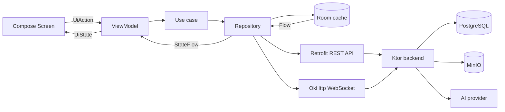
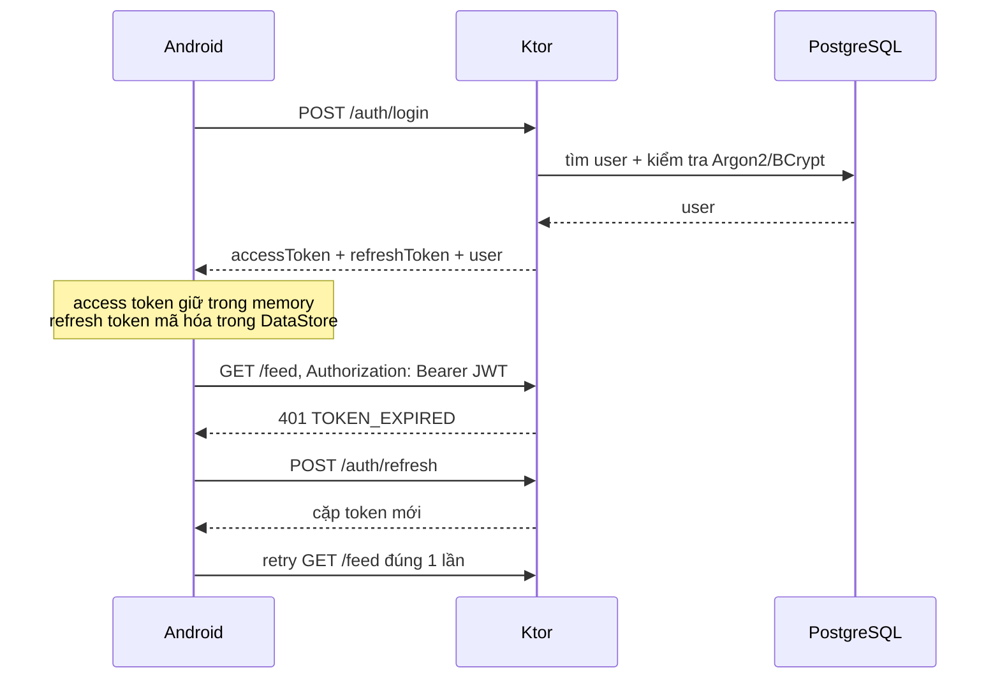
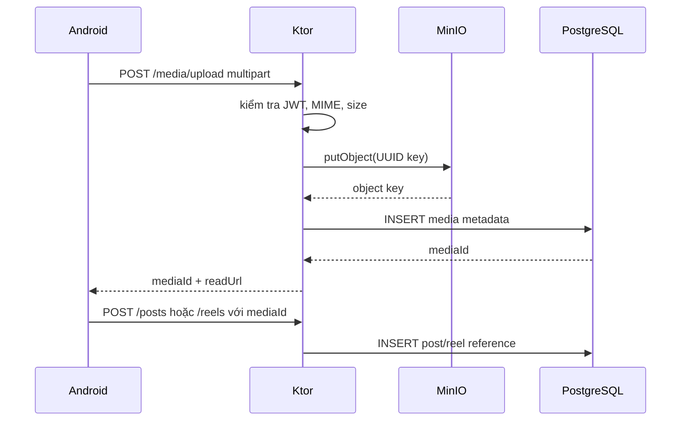
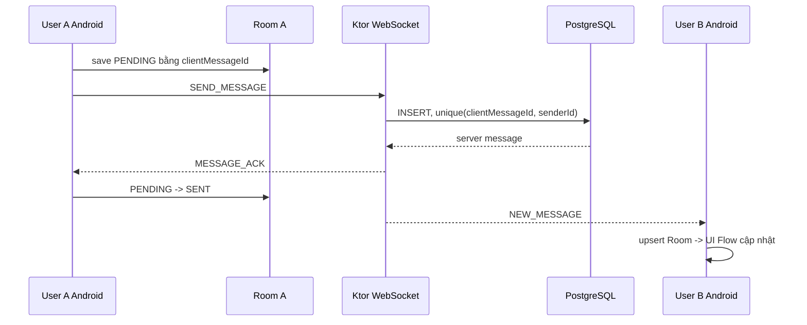

# LinkUp — kiến trúc project, REST API, WebSocket và database

Tài liệu này là hợp đồng kỹ thuật tổng thể để Android, backend và database có thể được phát triển song song.
Nhiều feature vẫn là prototype dùng `FakeLinkUpRepository`; Auth và Reels đã có API thật trong source.
Với Reels, ưu tiên [hợp đồng đã triển khai và hướng dẫn chạy](REELS_IMPLEMENTATION.md), bao gồm migration,
media storage và recommendation theo tương tác. Các endpoint dự kiến bên dưới không có nghĩa đã được triển khai hết.

## 1. Quyết định tổ chức Android

LinkUp dùng **một `MainActivity`**. Với Jetpack Compose, màn hình là `@Composable`, không cần tạo một Activity cho 
mỗi page. Cách này giữ back stack nhất quán, truyền tham số an toàn và tránh phải cùng sửa `AndroidManifest.xml`.

Để giảm conflict khi làm nhóm:

- `MainActivity.kt` chỉ khởi động app, gần như không cần sửa.
- Mỗi người sở hữu nguyên một folder trong `feature/`.
- `app/LinkUpApp.kt` là composition root và file tích hợp tạm thời; chỉ một người integration owner sửa.
- `core/` chỉ chứa thành phần dùng chung; thay đổi cần được review vì ảnh hưởng nhiều feature.
- Không truyền object repository trực tiếp giữa màn hình. Màn hình nhận state và phát callback.

```text
LinkUp/
├── app/                             # Android application module
│   └── src/main/.../
│       ├── MainActivity.kt          # entry point, không chứa nghiệp vụ
│       └── app/LinkUpApp.kt         # ghép route + dependency, integration owner
├── core/                            # Android library module
│   └── src/main/.../
│       ├── navigation/AppRoute.kt   # route và back stack
│       ├── ui/LinkUpComponents.kt   # component dùng chung
│       └── ui/theme/                # color, typography, theme
├── data/                            # Android library module
│   └── src/main/.../
│       ├── model/SocialModels.kt
│       └── repository/LinkUpRepository.kt
└── feature/                         # mỗi folder con là một library module
    ├── auth/src/main/.../AuthScreens.kt
    ├── feed/src/main/.../FeedScreens.kt
    ├── reels/src/main/.../{feed,player,upload,comments}/
    ├── profile/src/main/.../ProfileScreens.kt
    ├── chat/src/main/.../ChatScreens.kt
    ├── ai/src/main/.../AiScreens.kt
    ├── dating/src/main/.../DatingScreens.kt
    └── more/src/main/.../MoreScreens.kt
```

Dependency graph hiện tại:

```text
:app
├── :core
├── :data
└── :feature:*
    ├── :core
    └── :data
```

Không feature module nào phụ thuộc feature module khác. Mọi chuyển màn hình được phát ra bằng callback rồi 
`:app` quyết định route, nhờ đó feature có thể build độc lập và tránh dependency vòng.

Khi bước vào production, mỗi feature nên mở rộng cùng một mẫu:

```text
feature/feed/src/main/java/.../feed/
├── FeedScreen.kt          # UI thuần, nhận UiState và callback
├── FeedViewModel.kt       # StateFlow<FeedUiState>
├── FeedContract.kt        # UiState, UiAction, UiEffect
├── FeedUseCase.kt         # nghiệp vụ nếu đủ phức tạp
└── FeedRepository.kt      # interface thuộc domain/feature
```

## 2. Luồng dữ liệu chuẩn



Quy tắc quan trọng:

1. UI không gọi Retrofit/Room trực tiếp.
2. ViewModel không biết DTO của network; repository map DTO sang domain model.
3. PostgreSQL chỉ được backend truy cập. Android không kết nối thẳng database.
4. File ảnh/video không lưu BLOB trong PostgreSQL; lưu ở MinIO và DB chỉ giữ `media_id`, `storage_key`, metadata.
5. WebSocket dùng cho event realtime nhỏ. Upload media luôn dùng REST.

## 3. Hợp đồng response chung

Base URL emulator:

```text
http://10.0.2.2:8080/api/v1/
ws://10.0.2.2:8080/ws
```

Response thành công:

```json
{
  "data": {},
  "meta": {
    "requestId": "uuid",
    "nextCursor": null
  }
}
```

Response lỗi:

```json
{
  "error": {
    "code": "VALIDATION_ERROR",
    "message": "Email is invalid",
    "fields": { "email": "Invalid format" },
    "requestId": "uuid"
  }
}
```

Các status code thống nhất: `200/201/204`, `400` validation, `401` token lỗi, `403` không có quyền, `404`, `409` 
xung đột, `413` file lớn, `429` rate limit, `500` lỗi server.

## 4. Authentication



API:

| Method | Endpoint | Request chính | Kết quả |
|---|---|---|---|
| POST | `/auth/register` | name, username, email, password, birthDate, gender | token + user |
| POST | `/auth/login` | login, password, deviceId | token + user |
| POST | `/auth/refresh` | refreshToken | token mới |
| POST | `/auth/logout` | refreshToken | 204 |
| GET | `/auth/me` | Bearer token | current user |

Không log password/token, không hard-code JWT secret và không để AI key trong Android.

## 5. Feed, post, comment và like

| Method | Endpoint | Ghi chú |
|---|---|---|
| GET | `/posts?cursor=&limit=` | cursor pagination, mặc định 15 |
| POST | `/posts` | multipart `id`, `content`, tối đa 4 ảnh |
| GET | `/posts/{postId}` | chi tiết post |
| DELETE | `/posts/{postId}` | chỉ owner/admin |
| PUT | `/posts/{postId}/reaction` | like idempotent |
| DELETE | `/posts/{postId}/reaction` | idempotent |
| GET | `/posts/{postId}/comments?cursor=` | comment page |
| POST | `/posts/{postId}/comments` | `{id, content}` idempotent theo id |
| DELETE | `/posts/{postId}/comments/{commentId}` | chỉ chủ comment |
| GET | `/media/{mediaId}` | redirect URL Storage ký ngắn hạn |

Luồng mở Feed theo offline-first:

```text
Room emit cache -> UI hiện ngay
        |
        +-> GET /feed
              |
              +-> thành công: transaction upsert Room -> UI tự cập nhật
              +-> thất bại: giữ cache + hiện banner Offline/Retry
```

Like nên cập nhật optimistic. Nếu API lỗi, rollback giá trị và phát snackbar. Backend phải dùng unique key `(post_id, user_id)` để không tạo hai like khi retry.

## 6. Upload media và Reel

Không gửi file base64 trong JSON.



Object key gợi ý:

```text
avatars/{userId}/{uuid}.jpg
posts/{userId}/{postId}/{uuid}.jpg
reels/{userId}/{reelId}/{uuid}.mp4
chat/{conversationId}/{uuid}.mp4
```

API Reel: `GET /reels?cursor=`, `POST /reels`, `DELETE /reels/{id}`, `PUT/DELETE /reels/{id}/reaction`. URL đọc MinIO nên là presigned URL có hạn hoặc endpoint backend có authorization.

## 7. Chat REST + WebSocket

REST dùng để lấy lịch sử và upload media:

| Method | Endpoint |
|---|---|
| GET | `/conversations` |
| POST | `/conversations/direct/{userId}` |
| GET | `/conversations/{id}/messages?before=&limit=40` |
| POST | `/media/upload` |

WebSocket envelope:

```json
{
  "event": "SEND_MESSAGE",
  "requestId": "client-generated-uuid",
  "conversationId": "c123",
  "payload": {
    "clientMessageId": "local-uuid",
    "type": "TEXT",
    "text": "Hello",
    "mediaId": null
  }
}
```

ACK:

```json
{
  "event": "MESSAGE_ACK",
  "requestId": "client-generated-uuid",
  "payload": {
    "clientMessageId": "local-uuid",
    "messageId": "server-uuid",
    "createdAt": "2026-08-29T13:45:00Z"
  }
}
```



Event client: `SEND_MESSAGE`, `READ_MESSAGE`, `TYPING_START`, `TYPING_STOP`, `PING`. Event server: `MESSAGE_ACK`, `NEW_MESSAGE`, `NEW_NOTIFICATION`, `DATING_MATCH`, `ERROR`, `PONG`.

Khi mất mạng, WorkManager gửi lại record `PENDING/FAILED`. `clientMessageId` và unique constraint đảm bảo retry không nhân đôi tin.

## 8. Database ownership

Các bảng PostgreSQL cốt lõi:

```text
users 1---n posts 1---n post_media n---1 media
  |             |---n post_reactions
  |             └---n comments
  |
  |---n conversation_members n---1 conversations 1---n messages
  |                                                        └---0..1 media
  |---n notifications
  |---1 dating_profiles 1---n dating_photos
  |---n dating_swipes
  |---n dating_matches
  └---n ai_conversations 1---n ai_messages
```

Constraint tối thiểu:

- `users.email` và `users.username` unique, dùng normalized lowercase.
- `post_reactions(post_id, user_id)` unique.
- `follows(follower_id, following_id)` unique và không cho self-follow.
- `conversation_members(conversation_id, user_id)` unique.
- `messages(sender_id, client_message_id)` unique.
- `dating_swipes(source_user_id, target_user_id)` unique.
- Tất cả timestamp lưu UTC `timestamptz`; client chỉ format theo timezone.
- Dữ liệu quan hệ quan trọng dùng foreign key; soft delete cho user/post nếu cần audit.

## 9. Room và DataStore

Room là cache/source local, không phải bản sao hoàn chỉnh của PostgreSQL:

| Room entity | Mục đích |
|---|---|
| `CachedPostEntity` | feed offline |
| `CachedUserEntity` | author/profile cache |
| `ConversationEntity` | chat list |
| `MessageEntity` | lịch sử + pending queue |
| `NotificationEntity` | notification cache |
| `PendingUploadEntity` | resume/retry upload |
| `RemoteKeyEntity` | cursor pagination |

DataStore chỉ giữ settings nhỏ: server URL debug, theme, notification preference, current user id và token đã mã hóa. Không lưu feed/message JSON lớn trong DataStore.

## 10. Dating, notification và AI

- `POST /dating/swipes` nhận `targetUserId` + `decision`. Backend chạy transaction: insert swipe → tìm reverse LIKE → insert match unique → notification → phát `DATING_MATCH`.
- `GET /notifications`, `PUT /notifications/{id}/read`, `PUT /notifications/read-all`. Event realtime chỉ báo có thay đổi; DB vẫn là source of truth.
- `POST /ai/conversations/{id}/messages` nhận prompt. API key nằm backend. `AI_MODE=MOCK` trả response xác định để demo/test; `AI_MODE=REMOTE` gọi provider có timeout và rate limit.

## 11. Kiểm thử

Hiện tại chạy:

```powershell
.\gradlew.bat testDebugUnitTest assembleDebug
```

Các tầng test cần bổ sung dần:

1. Unit test: navigator, mapper DTO/domain, use case và reducer ViewModel.
2. Repository test: MockWebServer + Room in-memory, kiểm tra offline và rollback.
3. Compose UI test: nhập login, chuyển page, tạo post, gửi chat.
4. Backend integration test: Testcontainers PostgreSQL/MinIO, auth và idempotency.
5. Multi-user: hai emulator Alice/Bob cùng backend local, test post → like → notification và chat realtime.

Definition of done cho mỗi feature: UI có loading/empty/error/offline, unit test pass, API contract cập nhật, không sửa file feature của người khác và build `assembleDebug` thành công.

## 12. Chia việc ít conflict

| Owner | Folder chính | Không nên tự sửa |
|---|---|---|
| Android core/integration | module `:app`, `:core` | nội dung feature |
| Auth + Feed | `:feature:auth`, `:feature:feed` | chat/reels |
| Reels + Media + Profile | `:feature:reels`, `:feature:profile` | app routing trực tiếp |
| Chat + AI + Dating | `:feature:chat`, `:feature:ai`, `:feature:dating` | data model chung khi chưa thống nhất |
| Backend | `backend/src/...` | Android UI |

Khi thêm màn hình, feature owner tạo Screen/Contract/ViewModel trong module của mình và gửi tên route/callback cho integration owner ghép. Mỗi PR/commit nên chỉ chạm một module và các test liên quan. Nếu cần sửa model chung, tách thành commit riêng để các nhánh khác rebase dễ hơn.

## 13. Trạng thái triển khai hiện tại

- Auth dùng Retrofit gọi Ktor; backend đã kết nối PostgreSQL/Supabase. Android giữ token trong bộ nhớ, chưa lưu phiên qua lần khởi động app.
- Reels có repository/API riêng, UI phát/upload/comment và recommendation theo tương tác; cần migration Reels và storage sẵn sàng để chạy trọn luồng.
- Reels hỗ trợ MinIO hoặc local storage development khi chủ động cấu hình. Xem [hướng dẫn Reels](REELS_IMPLEMENTATION.md) cho contract và giới hạn thực tế.
- Các feature còn dùng `FakeLinkUpRepository` vẫn cập nhật state mock trong phiên chạy; không xem chúng là dữ liệu đã lưu Supabase.
- Room, offline queue bền vững và những endpoint chưa được nêu là đã triển khai vẫn là hướng phát triển tiếp theo.
