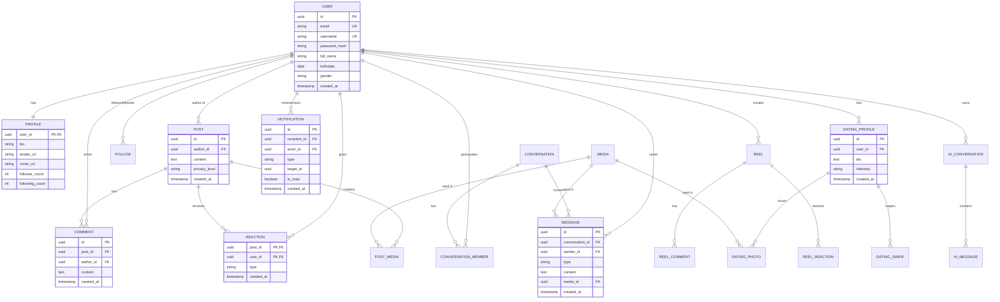

# Entity Relationship Diagram (ERD) - LinkUp

This diagram visualizes the relationships between the core entities in the LinkUp database.

```mermaid
erDiagram
    USER ||--|| PROFILE : "has"
    USER ||--o{ POST : "author of"
    USER ||--o{ COMMENT : "writes"
    USER ||--o{ REACTION : "gives"
    USER ||--o{ FOLLOW : "follows/followed"
    USER ||--o{ MESSAGE : "sends"
    USER ||--o{ CONVERSATION_MEMBER : "participates"
    USER ||--o{ REEL : "creates"
    USER ||--o{ NOTIFICATION : "receives/acts"
    USER ||--o{ DATING_PROFILE : "has"
    USER ||--o{ AI_CONVERSATION : "owns"

    POST ||--o{ POST_MEDIA : "contains"
    POST ||--o{ COMMENT : "has"
    POST ||--o{ REACTION : "receives"

    REEL ||--o{ REEL_COMMENT : "has"
    REEL ||--o{ REEL_REACTION : "receives"

    CONVERSATION ||--o{ CONVERSATION_MEMBER : "has"
    CONVERSATION ||--o{ MESSAGE : "contains"

    DATING_PROFILE ||--o{ DATING_PHOTO : "shows"
    DATING_PROFILE ||--o{ DATING_SWIPE : "swipes"

    AI_CONVERSATION ||--o{ AI_MESSAGE : "contains"

    MEDIA ||--o{ POST_MEDIA : "used in"
    MEDIA ||--o{ MESSAGE : "used in"
    MEDIA ||--o{ DATING_PHOTO : "used in"

    USER {
        uuid id PK
        string email UK
        string username UK
        string password_hash
        string full_name
        date birthdate
        string gender
        timestamp created_at
    }

    PROFILE {
        uuid user_id PK, FK
        string bio
        string avatar_url
        string cover_url
        int follower_count
        int following_count
    }

    POST {
        uuid id PK
        uuid author_id FK
        text content
        string privacy_level
        timestamp created_at
    }

    COMMENT {
        uuid id PK
        uuid post_id FK
        uuid author_id FK
        text content
        timestamp created_at
    }

    REACTION {
        uuid post_id PK, FK
        uuid user_id PK, FK
        string type
        timestamp created_at
    }

    MESSAGE {
        uuid id PK
        uuid conversation_id FK
        uuid sender_id FK
        string type
        text content
        uuid media_id FK
        timestamp created_at
    }

    DATING_PROFILE {
        uuid id PK
        uuid user_id FK
        text bio
        string interests
        timestamp created_at
    }

    NOTIFICATION {
        uuid id PK
        uuid recipient_id FK
        uuid actor_id FK
        string type
        uuid target_id
        boolean is_read
        timestamp created_at
    }
```
